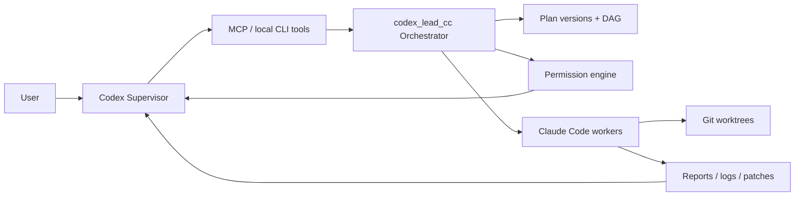
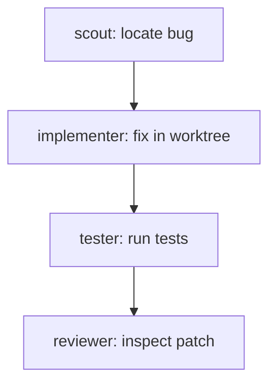

# codex_lead_cc

`codex_lead_cc` is a local Supervisor-Worker orchestration runtime for coding agents.

Codex acts as the supervisor: it plans work, creates Claude Code workers, assigns tasks, watches events, approves permissions, reviews reports and diffs, and decides the next step. Claude Code acts as the worker: it reads, implements, tests, and reviews inside boundaries managed by `codex_lead_cc`.



## Why This Exists

The project demonstrates a stricter agent runtime boundary:

- Codex does not directly read source files, run shell commands, or edit code.
- Codex only uses management tools: create workers, assign tasks, approve permissions, inspect events, read reports, read diffs, and collect metrics.
- Claude Code workers do tactical work in the project or an isolated worktree.
- The orchestrator owns worker state, task state, events, permissions, patches, reports, plans, sessions, and metrics.

## Current Status

Phase 0 proved the synchronous local loop:

```text
Codex -> cc_run_task -> claude -p -> JSON report
```

Phase 1 added the MVP orchestrator: worker/task records, async task execution, polling, reports, stop tools, logs, JSON persistence, and MCP stdio.

Phase 2 added engineering controls: permission requests, event log, worktree isolation, diff/patch artifacts, tester/reviewer roles, and basic multi-worker concurrency.

Phase 3 upgrades the project into a GitHub-showcase local runtime:

- Plan versioning with change reasons.
- Basic task DAG support with `blocked`, `ready`, `skipped`, and dependency wake-up.
- Worker session metadata, health checks, restart, and idle cleanup.
- Claude Code adapter abstraction with CLI adapter and SDK adapter fallback scaffold.
- Metrics for runtime, logs, reports, compression ratio, workers, permissions, and patches.
- Reproducible benchmark assets.
- Local status dashboard via `codex-lead-cc status --watch`.

Phase 4 adds Supervisor Wait Mode:

- Supervisor state tracking for `active`, `waiting`, `sleeping`, `reviewing`, and related states.
- Supervisor inbox notifications generated from event log facts.
- Central wake policy for permission requests, task completion, failures, patch generation, test completion, and review completion.
- `cc_wait_for_events` long-polling so Codex can sleep until a wake-worthy worker event appears.
- Summary/full/raw report levels, keeping wake packets lightweight by default.

## Install

```bash
npm install
npm run build
```

Requirements:

- Node.js 20 or newer.
- npm.
- Claude Code CLI available as `claude` on `PATH`.
- Claude Code logged in before assigning real tasks.

## Start MCP

```bash
node dist/index.js mcp
```

Example MCP client config:

```json
{
  "mcpServers": {
    "codex_lead_cc": {
      "command": "node",
      "args": ["/home/hs/code/codex_lead_cc/dist/index.js", "mcp"],
      "cwd": "/home/hs/code/codex_lead_cc"
    }
  }
}
```

## Quickstart

Create a plan:

```bash
node dist/index.js cc_create_plan \
  --project-id demo-project \
  --goal "Fix the demo project bug and add regression tests"
```

Create a scout worker:

```bash
node dist/index.js cc_create_worker \
  --project-path examples/demo-project \
  --project-id demo-project \
  --role scout
```

Assign a task:

```bash
node dist/index.js cc_assign_task \
  --worker-id ccw_001 \
  --plan-id plan_001 \
  --plan-task-id plan_001_step_001 \
  --task "Read this project and summarize structure and entry points." \
  --timeout-sec 300
```

Watch status:

```bash
node dist/index.js status --project-id demo-project --watch
```

Poll events:

```bash
node dist/index.js cc_get_updates --since-event-id 0 --project-id demo-project
```

Get a report:

```bash
node dist/index.js cc_get_report --task-id task_001 --level summary
```

Sleep until a worker produces a wake-worthy event:

```bash
node dist/index.js cc_set_supervisor_state \
  --project-id demo-project \
  --plan-id plan_001 \
  --state sleeping \
  --reason "All ready tasks are dispatched."

node dist/index.js cc_wait_for_events \
  --project-id demo-project \
  --plan-id plan_001 \
  --wake-on task_completed,task_failed,permission_requested,patch_generated,review_completed \
  --timeout-sec 30
```

## MCP Tools

Core task tools:

- `cc_run_task`
- `cc_create_worker`
- `cc_assign_task`
- `cc_get_status`
- `cc_get_report`
- `cc_stop_task`
- `cc_stop_worker`
- `cc_delete_worker`
- `cc_list_workers`
- `cc_list_tasks`

Event, permission, and patch tools:

- `cc_get_updates`
- `cc_get_pending_permissions`
- `cc_approve_permission`
- `cc_reject_permission`
- `cc_get_diff_summary`
- `cc_get_diff_detail`
- `cc_cleanup_worktree`

Phase 3 tools:

- `cc_create_plan`
- `cc_get_plan`
- `cc_update_plan`
- `cc_list_plans`
- `cc_get_metrics`
- `cc_restart_worker`
- `cc_get_worker_health`
- `cc_cleanup_idle_workers`

Phase 4 wait-mode tools:

- `cc_set_supervisor_state`
- `cc_get_supervisor_state`
- `cc_wait_for_events`
- `cc_get_inbox`
- `cc_mark_notifications_read`

The tool surface is intentionally managerial. It does not expose `read_file`, `run_shell`, or `edit_file` to Codex.

## Worker Roles

- `scout`: read-only project analysis.
- `implementer`: writes in an isolated git worktree by default and produces patch artifacts.
- `tester`: requests permission before running test commands and returns structured test results.
- `reviewer`: reads patch/diff artifacts and returns review findings.

## Plan And DAG Flow

Plans are versioned. Every update requires a reason and creates a plan change record.



Tasks can declare `depends_on`. The scheduler keeps blocked tasks out of the running queue until dependencies complete. Failed dependencies skip downstream tasks instead of silently running them.

## Permission Model

The permission engine supports `allow`, `ask`, and `deny` rules. Dangerous actions are denied by default; test and environment-changing actions are gated.

```bash
node dist/index.js cc_get_pending_permissions --project-id demo-project
node dist/index.js cc_approve_permission --request-id perm_001 --decision allow_for_task
node dist/index.js cc_reject_permission --request-id perm_001 --reason "Do not install dependencies."
```

## Worktree And Patch Workflow

Implementer workers default to isolated git worktrees:

```text
.agentforeman/worktrees/task_004_impl/
```

After implementation tasks finish, the orchestrator captures:

- `.agentforeman/patches/<task_id>.patch`
- `.agentforeman/patches/<task_id>.diff-summary.json`
- report fields: `files_modified`, `diff_summary`, `patch_path`, `worktree_path`

Phase 3 still does not auto-merge patches or open pull requests.

## Metrics And Benchmarks

Collect metrics:

```bash
node dist/index.js cc_get_metrics --project-id demo-project --plan-id plan_001
```

Run the benchmark dry-run:

```bash
npm run benchmark
```

Run the wait-mode smoke test:

```bash
npm run smoke:wait-mode
```

The benchmark directory contains reproducible task definitions and a sample result for the scout -> implementer -> tester -> reviewer flow.

## Local State

Runtime files are under `.agentforeman/` by default:

```text
.agentforeman/
├─ state.json
├─ logs/
├─ reports/
├─ patches/
├─ worktrees/
├─ metrics/
└─ tmp/
```

Set `AGENTFOREMAN_HOME` to use a different runtime directory.

Optional config file:

```json
{
  "max_concurrent_workers": 3,
  "worker_idle_timeout_sec": 900,
  "runtime": {
    "default_adapter": "claude_cli",
    "enable_sdk_adapter": false,
    "fallback_to_cli": true
  },
  "permission_rules": []
}
```

## Demo Walkthrough

The demo project intentionally starts with a simple bug so the full orchestration path is visible:

1. Create a plan for `demo-project`.
2. Create a `scout` worker and inspect the project through a report.
3. Update the plan after the scout report.
4. Create an `implementer` worker and fix the bug in an isolated worktree.
5. Review the generated diff summary and patch.
6. Create a `tester` worker.
7. Approve the tester permission request.
8. Read the structured test report.
9. Create a `reviewer` worker.
10. Read review findings and final metrics.

See [docs/demo-walkthrough.md](docs/demo-walkthrough.md) for the full command sequence.

## Current Limits

- JSON state is still used instead of SQLite.
- Permission gating is modeled at the orchestrator layer; deep Claude Code permission hooks are reserved for a later adapter pass.
- The SDK adapter is a Phase 3 scaffold with CLI fallback, not a full SDK runtime replacement.
- Worktree isolation requires git. Non-git projects fall back to direct mode.
- Patch merge, PR creation, cloud execution, multi-user auth, and distributed workers are not implemented.

## Resume Project Description

`codex_lead_cc` is a local multi-agent coding runtime that separates strategic supervision from tactical execution. Codex manages plans, permissions, events, reports, diffs, and metrics while Claude Code workers execute isolated implementation, testing, and review tasks through an MCP-compatible orchestrator.
