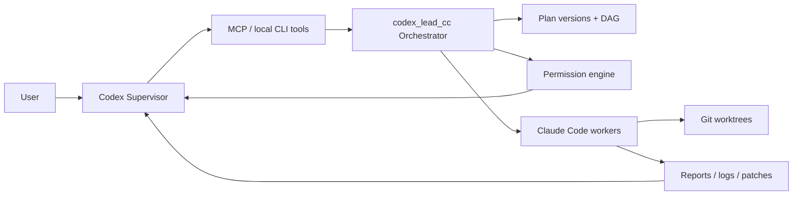
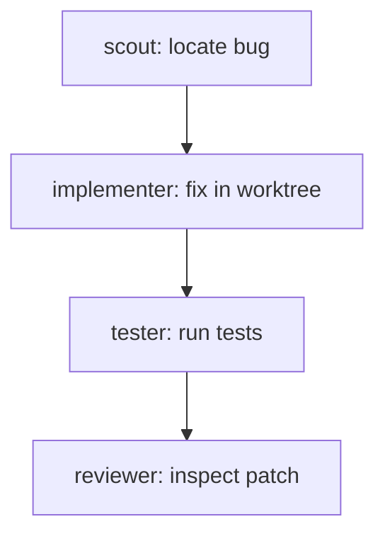

# codex_lead_cc

`codex_lead_cc` is a local Supervisor-Worker orchestration runtime for coding agents.

Codex acts as the supervisor: it plans work, creates Claude Code workers, assigns tasks, watches events, approves permissions, reviews reports and diffs, and decides the next step. Claude Code acts as the worker: it reads, implements, tests, and reviews inside boundaries managed by `codex_lead_cc`.



## Why This Exists

The project demonstrates a stricter agent runtime boundary:

- Codex does not directly read source files, run shell commands, or edit code.
- Codex only uses management tools: create workers, assign tasks, approve permissions, inspect events, read reports, read diffs, and collect metrics.
- Claude Code workers do tactical work in the project or an isolated worktree.
- The orchestrator owns worker state, task state, events, permissions, patches, reports, plans, sessions, and metrics.

## Current Status

Phase 0 proved the synchronous local loop:

```text
Codex -> cc_run_task -> claude -p -> JSON report
```

Phase 1 added the MVP orchestrator: worker/task records, async task execution, polling, reports, stop tools, logs, JSON persistence, and MCP stdio.

Phase 2 added engineering controls: permission requests, event log, worktree isolation, diff/patch artifacts, tester/reviewer roles, and basic multi-worker concurrency.

Phase 3 upgrades the project into a GitHub-showcase local runtime:

- Plan versioning with change reasons.
- Basic task DAG support with `blocked`, `ready`, `skipped`, and dependency wake-up.
- Worker session metadata, health checks, restart, and idle cleanup.
- Claude Code adapter abstraction with CLI adapter and SDK adapter fallback scaffold.
- Metrics for runtime, logs, reports, compression ratio, workers, permissions, and patches.
- Reproducible benchmark assets.
- Local status dashboard via `node dist/index.js status --watch`.

Phase 4 adds Supervisor Wait Mode:

- Supervisor state tracking for `active`, `waiting`, `sleeping`, `reviewing`, and related states.
- Supervisor inbox notifications generated from event log facts.
- Central wake policy for permission requests, task completion, failures, patch generation, test completion, and review completion.
- `cc_wait_for_events` long-polling so Codex can sleep until a wake-worthy worker event appears.
- Summary/full/raw report levels, keeping wake packets lightweight by default.

Phase 5 adds mode isolation and a compact MCP gateway:

- `codex` remains ordinary Codex and is not modified by this project.
- `codex_lead_cc` starts Codex in Supervisor Mode with transient config overrides.
- Supervisor Mode defaults to compact MCP exposure: `cc_dispatch`, `cc_wait`, `cc_inspect`, and `cc_decide`.
- Full fine-grained `cc_*` tools remain available for CLI use and dev-mode MCP exposure.
- The wrapper does not edit the default Codex config, so ordinary `codex mcp list` is not polluted.

Phase 6 adds Supervisor isolation and user configuration:

- `codex_lead_cc` always starts Codex from `supervisor_home`, not the caller project directory.
- The caller directory is registered as the active worker project in runtime state.
- Supervisor tools see `project_id` values such as `proj_001`; internal state maps them to real paths for workers.
- Worker creation and dispatch inherit the active project session, so compact gateway calls do not need `project_path`.
- User configuration lives in `~/.codex_lead_cc/config.json`.

## Install

### Recommended: install from GitHub

```bash
npm install -g --install-links=true git+https://github.com/zake-cn/codex_lead_cc.git
codex_lead_cc --doctor
```

The Git URL install uses the committed `dist/` build output and does not run a TypeScript build during installation. End users do not need a local TypeScript compiler.
The `--install-links=true` flag makes npm install the Git dependency as a real package instead of a transient cache symlink.

### Update

```bash
codex_lead_cc update
```

or manually:

```bash
npm install -g --install-links=true git+https://github.com/zake-cn/codex_lead_cc.git
```

### Development Install

```bash
git clone https://github.com/zake-cn/codex_lead_cc.git
cd codex_lead_cc
npm install
npm run build
npm link
codex_lead_cc --doctor
```

## Requirements

- Node.js 20 or newer.
- npm.
- Codex CLI available as `codex` on `PATH` for the `codex_lead_cc` wrapper.
- Claude Code CLI available as `claude` on `PATH`.

Authentication note:

`codex_lead_cc` does not check or enforce Claude Code login state. Configure Claude Code according to your own environment. Login state, API keys, custom base URLs, proxies, enterprise settings, or other runtime settings are outside the scope of this project.

## Normal Codex Vs Supervisor Mode

Ordinary Codex:

```bash
codex
```

This remains the user's normal Codex session. It does not load `codex_lead_cc`, and this project does not write to the default Codex config.

Supervisor Mode:

```bash
codex_lead_cc
```

This starts the real `codex` binary with temporary `-c` config overrides that attach the local `codex_lead_cc` MCP server in compact mode. The default global Codex MCP list is not changed.

Useful wrapper commands:

```bash
codex_lead_cc --doctor
codex_lead_cc --dry-run
codex_lead_cc --print-config
codex_lead_cc config show
codex_lead_cc config reset
codex_lead_cc config path
codex_lead_cc --mode supervisor --mcp-exposure compact
codex_lead_cc --mode dev --mcp-exposure full
```

## Supervisor Isolation

When launched from a project:

```bash
cd my_project
codex_lead_cc
```

Codex runs from:

```text
~/.codex_lead_cc/supervisor
```

Claude Code workers inherit the caller project through an internal session mapping:

```text
proj_001 -> /absolute/path/to/my_project
```

The Supervisor receives `project_id`, task IDs, reports, diff summaries, inbox notifications, and metrics. It does not need the real project path for normal compact gateway operation.

Default user config:

```json
{
  "version": 1,
  "supervisor_home": "~/.codex_lead_cc/supervisor",
  "runtime_home": "~/.codex_lead_cc/runtime",
  "default_mcp_exposure": "compact",
  "worker_mode": "caller_directory",
  "max_workers": 8,
  "idle_cleanup_minutes": 30
}
```

## Start MCP

```bash
node dist/index.js mcp --exposure compact
node dist/index.js mcp --exposure full
```

Compact exposure registers only gateway tools. Full exposure registers gateway tools plus all fine-grained legacy/dev tools.

Example manual MCP client config:

```json
{
  "mcpServers": {
    "codex_lead_cc": {
      "command": "node",
      "args": ["/home/hs/code/codex_lead_cc/dist/index.js", "mcp", "--exposure", "compact"],
      "cwd": "/home/hs/code/codex_lead_cc"
    }
  }
}
```

## Gateway Quickstart

Create a plan through the compact gateway:

```bash
node dist/index.js cc_dispatch \
  --action create_plan \
  --project-id demo-project \
  --goal "Fix the demo project bug and add regression tests"
```

Create a scout task through the compact gateway:

```bash
node dist/index.js cc_dispatch \
  --action create_scout_task \
  --project-path examples/demo-project \
  --project-id demo-project \
  --task "Read this project and summarize structure and entry points." \
  --timeout-sec 300
```

Inspect status through the compact gateway:

```bash
node dist/index.js cc_inspect --action get_status --project-id demo-project
```

Watch status:

```bash
node dist/index.js status --project-id demo-project --watch
```

Poll events with the legacy/dev tool:

```bash
node dist/index.js cc_get_updates --since-event-id 0 --project-id demo-project
```

Get a report:

```bash
node dist/index.js cc_get_report --task-id task_001 --level summary
```

Sleep until a worker produces a wake-worthy event:

```bash
node dist/index.js cc_set_supervisor_state \
  --project-id demo-project \
  --plan-id plan_001 \
  --state sleeping \
  --reason "All ready tasks are dispatched."

node dist/index.js cc_wait_for_events \
  --project-id demo-project \
  --plan-id plan_001 \
  --wake-on task_completed,task_failed,permission_requested,patch_generated,review_completed \
  --timeout-sec 30
```

## MCP Tools

Supervisor compact gateway tools:

- `cc_dispatch`: create/update plans, create workers, assign tasks, restart workers, dispatch ready work.
- `cc_wait`: enter Supervisor Wait Mode and return lightweight wake packets.
- `cc_inspect`: read status, plans, inbox, report summaries, diff summaries, permissions, metrics, and health.
- `cc_decide`: approve/reject permissions, stop/restart workers or tasks, mark notifications read, set supervisor state.

All gateway tools return a consistent envelope:

```json
{
  "ok": true,
  "action": "get_status",
  "data": {},
  "warnings": []
}
```

Dev-mode and advanced CLI tools are still available in full exposure:

- `cc_run_task`
- `cc_create_worker`
- `cc_assign_task`
- `cc_get_status`
- `cc_get_report`
- `cc_stop_task`
- `cc_stop_worker`
- `cc_delete_worker`
- `cc_list_workers`
- `cc_list_tasks`

Event, permission, and patch tools:

- `cc_get_updates`
- `cc_get_pending_permissions`
- `cc_approve_permission`
- `cc_reject_permission`
- `cc_get_diff_summary`
- `cc_get_diff_detail`
- `cc_cleanup_worktree`

Phase 3 tools:

- `cc_create_plan`
- `cc_get_plan`
- `cc_update_plan`
- `cc_list_plans`
- `cc_get_metrics`
- `cc_restart_worker`
- `cc_get_worker_health`
- `cc_cleanup_idle_workers`

Phase 4 wait-mode tools:

- `cc_set_supervisor_state`
- `cc_get_supervisor_state`
- `cc_wait_for_events`
- `cc_get_inbox`
- `cc_mark_notifications_read`

The tool surface is intentionally managerial. It does not expose `read_file`, `run_shell`, or `edit_file` to Codex.

## Worker Roles

- `scout`: read-only project analysis.
- `implementer`: writes in an isolated git worktree by default and produces patch artifacts.
- `tester`: requests permission before running test commands and returns structured test results.
- `reviewer`: reads patch/diff artifacts and returns review findings.

## Plan And DAG Flow

Plans are versioned. Every update requires a reason and creates a plan change record.



Tasks can declare `depends_on`. The scheduler keeps blocked tasks out of the running queue until dependencies complete. Failed dependencies skip downstream tasks instead of silently running them.

## Permission Model

The permission engine supports `allow`, `ask`, and `deny` rules. Dangerous actions are denied by default; test and environment-changing actions are gated.

```bash
node dist/index.js cc_get_pending_permissions --project-id demo-project
node dist/index.js cc_approve_permission --request-id perm_001 --decision allow_for_task
node dist/index.js cc_reject_permission --request-id perm_001 --reason "Do not install dependencies."
```

## Worktree And Patch Workflow

Implementer workers default to isolated git worktrees:

```text
.agentforeman/worktrees/task_004_impl/
```

After implementation tasks finish, the orchestrator captures:

- `.agentforeman/patches/<task_id>.patch`
- `.agentforeman/patches/<task_id>.diff-summary.json`
- report fields: `files_modified`, `diff_summary`, `patch_path`, `worktree_path`

Phase 3 still does not auto-merge patches or open pull requests.

## Metrics And Benchmarks

Collect metrics:

```bash
node dist/index.js cc_get_metrics --project-id demo-project --plan-id plan_001
```

Run the benchmark dry-run:

```bash
npm run benchmark
```

Run the wait-mode smoke test:

```bash
npm run smoke:wait-mode
npm run smoke:gateway
npm run smoke:wrapper
```

The benchmark directory contains reproducible task definitions and a sample result for the scout -> implementer -> tester -> reviewer flow.

## Local State

Runtime files are under `.agentforeman/` by default:

```text
.agentforeman/
├─ state.json
├─ logs/
├─ reports/
├─ patches/
├─ worktrees/
├─ metrics/
└─ tmp/
```

Set `AGENTFOREMAN_HOME` to use a different runtime directory.

## Disable Or Inspect

Because `codex_lead_cc` uses transient Codex config overrides, disabling it is simply a matter of using ordinary Codex:

```bash
codex
```

To inspect what Supervisor Mode would inject:

```bash
codex_lead_cc --dry-run
codex_lead_cc --print-config
```

To run Codex through the wrapper without attaching the MCP server:

```bash
codex_lead_cc --mode off
```

## Troubleshooting

```bash
codex_lead_cc --doctor
codex mcp list
node dist/index.js mcp --exposure compact
node dist/index.js mcp --exposure full
```

`codex mcp list` should not show `codex_lead_cc` unless you manually registered it yourself. The wrapper does not persist MCP config.

Optional config file:

```json
{
  "max_concurrent_workers": 3,
  "worker_idle_timeout_sec": 900,
  "runtime": {
    "default_adapter": "claude_cli",
    "enable_sdk_adapter": false,
    "fallback_to_cli": true
  },
  "permission_rules": []
}
```

## Demo Walkthrough

The demo project intentionally starts with a simple bug so the full orchestration path is visible:

1. Create a plan for `demo-project`.
2. Create a `scout` worker and inspect the project through a report.
3. Update the plan after the scout report.
4. Create an `implementer` worker and fix the bug in an isolated worktree.
5. Review the generated diff summary and patch.
6. Create a `tester` worker.
7. Approve the tester permission request.
8. Read the structured test report.
9. Create a `reviewer` worker.
10. Read review findings and final metrics.

See [docs/demo-walkthrough.md](docs/demo-walkthrough.md) for the full command sequence.

## Current Limits

- JSON state is still used instead of SQLite.
- Permission gating is modeled at the orchestrator layer; deep Claude Code permission hooks are reserved for a later adapter pass.
- The SDK adapter is a Phase 3 scaffold with CLI fallback, not a full SDK runtime replacement.
- Worktree isolation requires git. Non-git projects fall back to direct mode.
- Patch merge, PR creation, cloud execution, multi-user auth, and distributed workers are not implemented.

## Resume Project Description

`codex_lead_cc` is a local multi-agent coding runtime that separates strategic supervision from tactical execution. Codex manages plans, permissions, events, reports, diffs, and metrics while Claude Code workers execute isolated implementation, testing, and review tasks through an MCP-compatible orchestrator.
