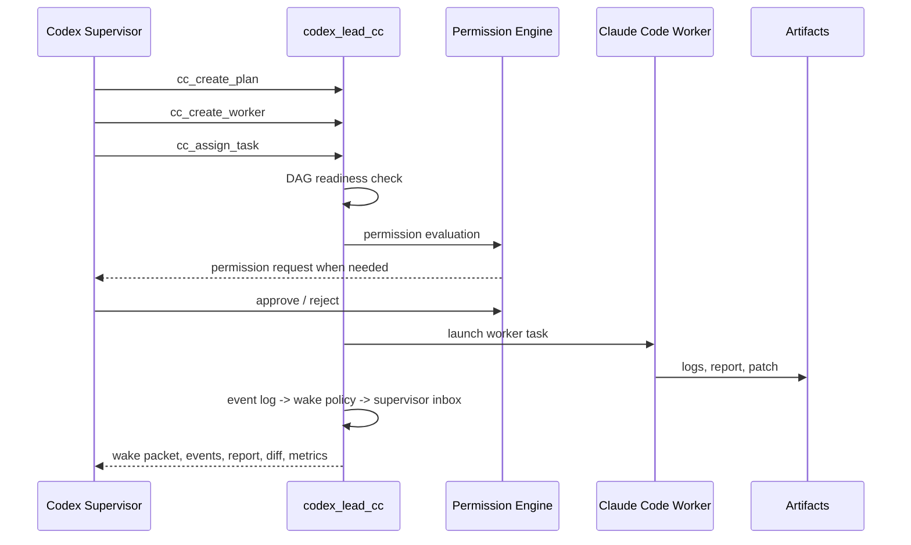

# Architecture

`codex_lead_cc` is a local Supervisor-Worker runtime.

## Control Boundary

Codex does not directly read project source, run shell commands, or edit files. It calls management tools:

- create/list workers
- create/update plans
- assign/stop tasks
- poll events
- approve/reject permissions
- read reports
- read diff summaries/details
- collect metrics

Claude Code performs tactical work inside a project directory or managed worktree.

## Components

- `mcp/server.ts`: MCP stdio tool surface.
- `mcp/exposure.ts`: compact/full exposure policy.
- `services/codex_lead_service.ts`: unified service facade used by compatibility tools.
- `services/dispatch_service.ts`: compact gateway dispatch actions.
- `services/wait_service.ts`: compact gateway wait actions.
- `services/inspect_service.ts`: compact gateway inspect actions.
- `services/decision_service.ts`: compact gateway decision actions.
- `services/admin_service.ts`: dev-mode admin gateway actions.
- `tools/*`: stable compatibility wrappers that keep the public `cc_*` names.
- `tools/tool_catalog.ts`: local CLI command catalog for flags and handlers.
- `orchestrator/plan_manager.ts`: versioned supervisor plans.
- `orchestrator/dag_scheduler.ts`: dependency readiness transitions.
- `orchestrator/task_manager.ts`: task records, assignment, reports, stopping.
- `orchestrator/worker_manager.ts`: worker lifecycle and session creation.
- `orchestrator/session_manager.ts`: health checks, restart, idle cleanup.
- `orchestrator/scheduler.ts`: queue and `max_concurrent_workers`.
- `orchestrator/permission_engine.ts`: allow/ask/deny rules and approval state.
- `orchestrator/event_log.ts`: event polling.
- `orchestrator/supervisor_state.ts`: supervisor state such as active, waiting, or sleeping.
- `orchestrator/supervisor_inbox.ts`: lightweight notifications derived from event log facts.
- `orchestrator/wake_policy.ts`: centralized event-to-notification mapping and wake priority.
- `orchestrator/wait_controller.ts`: long-poll wait channel for `cc_wait_for_events`.
- `orchestrator/worktree_manager.ts`: git worktree isolation.
- `orchestrator/diff_manager.ts`: patch and diff artifacts.
- `orchestrator/metrics_collector.ts`: runtime/report/log metrics.
- `orchestrator/state_store.ts`: JSON state with a lightweight lock.
- `orchestrator/task_worker_entry.ts`: detached background runner.
- `claude/*adapter.ts`: CLI adapter, runtime adapter facade, and SDK fallback abstraction.
- `dashboard/status_tui.ts`: local status dashboard.

## Runtime Flow



## State

Phase 3 still keeps JSON state for portability:

```text
.agentforeman/state.json
```

The state includes workers, sessions, tasks, plans, plan changes, events, supervisor states, notifications, permission requests, permission rules, and artifacts.

SQLite remains a possible later upgrade.
