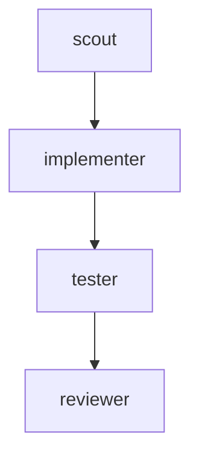

# Plan And DAG

Phase 3 introduces versioned supervisor plans and a basic task DAG.

## Plan Records

A plan contains:

- `plan_id`
- `project_id`
- `version`
- `goal`
- `status`
- task nodes
- history snapshots
- change records

Every `cc_update_plan` call requires a `reason` and creates a `plan_change` record.

## Task Dependencies

Tasks can declare `depends_on` task IDs. Plan task nodes can also depend on other plan task node IDs.

## Scheduler Behavior

- `pending` tasks become `blocked` if dependencies are incomplete.
- `blocked` tasks become `ready` after dependencies complete.
- `ready` tasks are eligible for permission checks and worker execution.
- downstream tasks become `skipped` if a dependency fails, stops, times out, or is skipped.

This is not a full workflow engine. It is a small local DAG readiness layer for agent orchestration demos.
