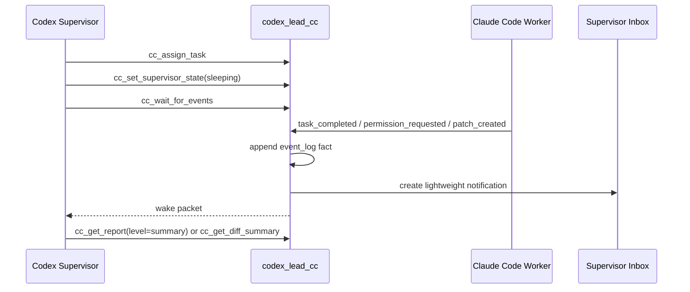

# Supervisor Wait Mode

Phase 4 adds an event-driven sleep/wake layer on top of the existing event log.

The orchestrator still cannot push text into Codex without a tool call. Instead, Codex calls `cc_wait_for_events`, the orchestrator long-polls local state, and the call returns when a wake-worthy notification appears or the timeout expires.

## Flow



## Layers

- `event_log`: immutable facts about worker, task, permission, patch, and plan activity.
- `wake_policy`: maps important events into prioritized notifications.
- `supervisor_inbox`: stores unread notifications for Codex.
- `wait_controller`: implements long polling and returns a compact wake packet.

## Wake Policy

Wake-worthy events include `permission_requested`, `task_completed`, `task_failed`, `task_timeout`, `patch_generated`, `test_completed`, `review_completed`, `worker_stalled`, `worker_crashed`, `dag_unblocked`, and `plan_completed`.

Non-wake events such as `heartbeat`, `worker_stdout_chunk`, `file_read`, `stage_changed`, `minor_progress`, and `log_updated` stay in the event log only.

## Tool Sequence

Set the supervisor to sleeping after dispatching all currently ready work:

```bash
node dist/index.js cc_set_supervisor_state \
  --project-id demo-project \
  --plan-id plan_001 \
  --state sleeping \
  --reason "All ready tasks are dispatched; waiting for worker results."
```

Wait for critical events:

```bash
node dist/index.js cc_wait_for_events \
  --project-id demo-project \
  --plan-id plan_001 \
  --since-event-id 120 \
  --wake-on task_completed,task_failed,permission_requested,patch_generated,review_completed \
  --timeout-sec 30 \
  --max-events 5
```

Read the inbox without loading full reports:

```bash
node dist/index.js cc_get_inbox \
  --project-id demo-project \
  --only-unread true \
  --min-priority medium
```

Mark handled notifications as read:

```bash
node dist/index.js cc_mark_notifications_read --notification-ids note_001,note_002
```

## Report Loading

Wake packets are intentionally small. They contain event IDs, task IDs, worker IDs, artifact references, summaries, and recommended next actions.

Codex should load details lazily:

```bash
node dist/index.js cc_get_report --task-id task_001 --level summary
node dist/index.js cc_get_report --task-id task_001 --level full
node dist/index.js cc_get_report --task-id task_001 --level raw
```

Default `cc_get_report` behavior remains `full` for backwards compatibility. Phase 4 supervisor behavior should prefer `summary` after a wake packet and use `raw` only for failure triage.

## Codex Supervisor Rules

- Dispatch all currently ready tasks before sleeping.
- Use `cc_set_supervisor_state` before entering a long wait.
- Use `cc_wait_for_events` instead of busy-polling `cc_get_updates`.
- On `permission_requested`, inspect and approve or reject the permission first.
- On `patch_generated`, read diff summary before full implementation output.
- On `test_completed`, read summary test report before review.
- On `review_completed`, read review summary and decide accept, request changes, or reject.
- On timeout with running tasks, continue sleeping unless the user has new input.
- Do not load full reports, raw logs, or diff details unless the wake packet indicates they are needed.
